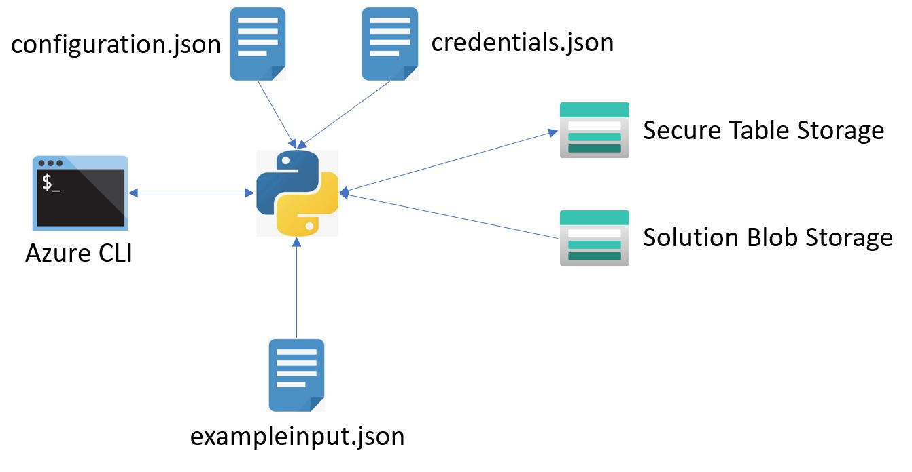

# AzureStorageValidation

Certain projects require larger files to be stored in Azure Blob Storage which are then used in a delivery of a product or service. 

While storage accounts should be locked down tight, there is always a chance that a file gets updated either maliciously or accidentally that can affect how the product or service behaves. 

This utility is designed to be used to validate those Azure Storage files to ensure they have not been tampered with between deliveries of your service or product. 

# Contents
- [Architecture](#architecture)
    - [Actions](#actions)
- Configuration Files
    - [configuration.json](#configurationjson)
    - [credentials.json](#credentialsjson)
    - [exampleinput.json](exampleinputjson)
- [Usage](#usage)
    - [Prerequisites](#prerequisites)
    - [Injest](#injest)
    - [Validation](#validation)
    - [Rebase](#rebase)

# Architecture


The project is a simple Python project that is supplied with different configurations to support different scenarios. 

When a file is added, or modified, to Azure Blob Storage an MD5 content hash is automatically created and associated with the object. If the file changes, the hash changes so it is a reasonable way to determine if a file has been modified at any time since it was injected into the storage account. 

The hash and other data about each blob that you wisht to track in Azure Storage is kept in the table storage. Each blob has a single entry in the table. 

The storage table that is tracking this information may or may not be in the same storage account as the blobs being tracked. It doesn't even need to be in the same subscription.  


## Actions

In general, as a user you will perform the actions in this order from top top bottom. You will revisit the second and third steps fairly regularly and the first step very infrequently if at all after the first run. 

- Injest a batch of blob information into the storage table. 
    - Injesting the same file has the same effect as a rebase.
    - This step is used to seed the storage table, or add to the entries. 
- Validate that the files that have been recorded in the storage table still have the same MD5 hash in the storage account.
    - This step is used to ensure that your blobs have not changed since you put them in or last validated your service/product. This should be run each time before performing a deployment/install. 
- Rebase all of the files that have been recorded in the storage table by obtaing the current hash and updating the table if the hash value is different. 
    - This step should be done ONLY when you know you have updated one of the blobs that is being tracked as it will go through each entry and update the stored has in the storage table if it has changed. 

[Back to table of content](#contents)


# configuration.json
```json
{
    "historyStorage" : {
        "account": "storage_account_name",
        "subscription" : "subscription_id_with_account",
        "table" : "validation"
    },
    "industries" : [
        "list of possible industries to allow in"
    ]
}
```
The configuration json file is used to tell the application where the table storage is where records are being kept. Further it identifies the potential industries in which records are grouped.

[Back to table of content](#contents)

# credentials.json
```json
{
    "usePrincipal" : false,
    "application" : "SP APP ID",
    "credential" : "SP SECRET",
    "tenent" : "SP TENENT"
}
```
The credentials.json file is used to let the application know if it should be using a service principal. If usePrincipal is false, the user MUST have already used az login before running the program. 

Further, the user or service principal (whichever login is in effect), must have IAM rights to all storage accounts that will be affected.

[Back to table of content](#contents)

# exampleinput.json
```json
{
    "account" : "account_where_blobs_live",
    "subscription" : "sub_id_for_above_acccount",
    "industry" : "industry_from_configuration_json",
    "blobs" :[
        "blob path with container, i.e.",
        "container/path/path/file.xxx"
    ]
}
```
This input file is used for ingestion. The user who wishes to track certain files supplies the appropriate settings in this file which is then passed to the application. 

[Back to table of content](#contents)

# Usage
As mentioned there are 3 ways to use the application to manage and trac the known state (Content MD5 hash) of Azure Storage blobs. 

For details on each step see [Actions](#actions).

## Prerequisites

- Azure Subscription(s) with the storage account(s) to be used in tracking and validating. 
    - You may choose to use the same storage account for the tracking table or a completely different account (even in another subscription)
- An Azure login (az login) that provides you with rights to the storage account(s) being used.
    - You can also use a Service Principal when executing this code, but that SP must also have rights to the storage account(s) being used.
- The Azure CLI installed on your machine.
- Use the conda environment StorageValidate
```
conda env create -f environment.yml
```
- A list of blobs you want to track, modify the exampleinput.json file with your settings. 

## Injest
Injest information about a set of azure blobs from a given storage account in a given subscription (in which your login has access to).

```
python app.py -injest -settings "./exampleinput.json"
```

## Validation
Validate that the blob hashes have not changed since the last time they were inserted. 

```
python app.py -validate -industry INDUSTRY_IN_CONF
```

## Rebase
For each blob in the industry set, get the latest hash and update the storage table. 

<b>NOTE</b> Use this only when you have updated a blob and want it's latest hash put in the table. 

```
python app.py -rebase -industry INDUSTRY_IN_CONF
```
[Back to table of content](#contents)

